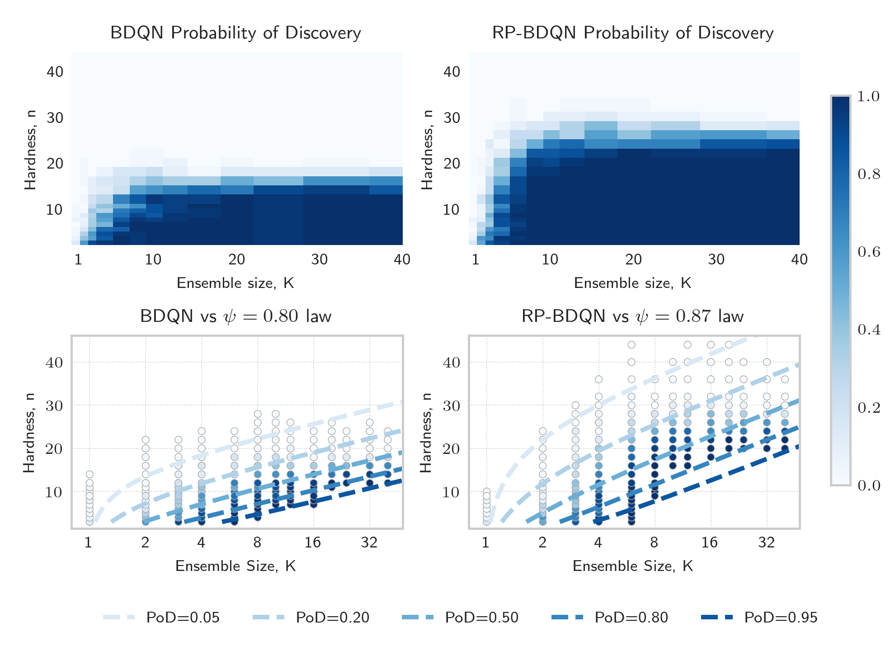
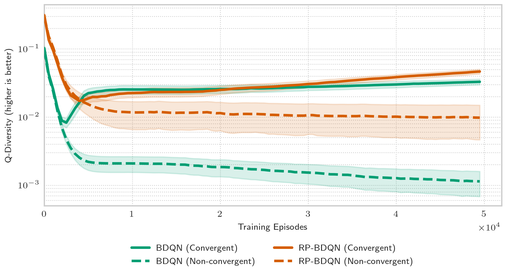
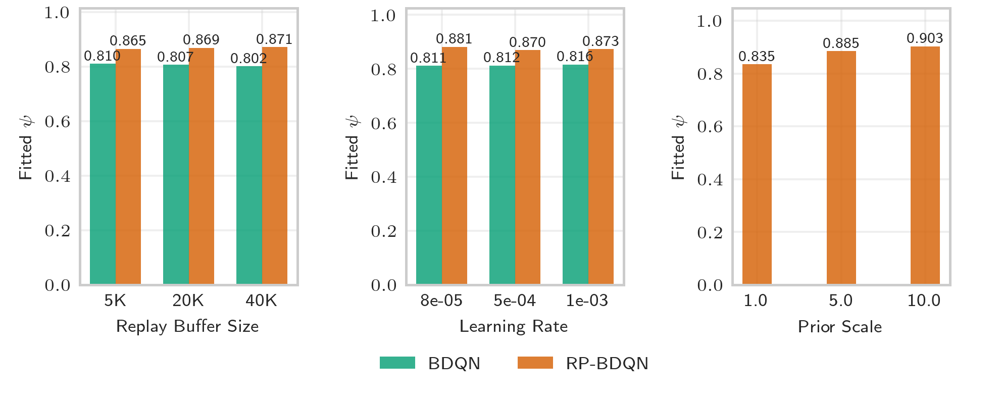

# A Unified Scaling Law of Bootstrapped DQNs


This repository implements **Bootstrapped DQN (BDQN)** and **Randomized-Prior BDQN (RP-BDQN)** in JAX, supporting the research findings presented in our paper *"A Unified Scaling Law for Bootstrapped DQNs"*. The implementation is designed for large-scale empirical studies of ensemble-based exploration methods in deep reinforcement learning.

## Research Overview

Our work presents the first comprehensive empirical study (>40,000 configurations) of bootstrapped DQN methods, revealing a unified scaling law that governs their convergence behavior:

```
P(convergence) ≈ 1 - (1 - ψⁿ)ᴷ
```

Where:
- **ψ** is the method-specific effectiveness parameter
- **n** is the task hardness (DeepSea grid size)
- **K** is the ensemble size

### Key Findings

- **RP-BDQN significantly outperforms BDQN**: ψ ≈ 0.87 vs ψ ≈ 0.80
- **RP-BDQN solves ~1.5× harder tasks** than BDQN with equivalent ensemble sizes
- **Diminishing returns** for ensemble sizes K > 10
- **Posterior collapse** is the primary failure mode in BDQN, mitigated by randomized priors



## Architecture

### Core Components

- **`main.py`** - Main training orchestrator with parallel execution support
- **`models.py`** - Neural network architectures (Model, ModelWithPrior, Bootstrapped ensembles)
- **`replay_buffer.py`** - JAX-optimized replay buffer with compression support
- **`evaluate.py`** - Analysis pipeline for generating scaling law plots and statistics
- **`helpers.py`** - Utilities for data serialization and experiment management

### Agent Types

1. **`boot`** - Bootstrapped DQN with K ensemble members
2. **`bootrp`** - Bootstrapped DQN with Randomized Priors
3. **`eps`** - Epsilon-greedy baseline (single network)

## Quick Start

This section provides the quickest way to get started with running the experiments and generating results.

### Prerequisites

Before you begin, you will need to install `uv`, a fast Python package installer and resolver. You can find the official installation instructions [here](https://github.com/astral-sh/uv).

### Dependency Management with `uv`

We use `uv` to manage Python dependencies, which are defined in `pyproject.toml`. Doing e.g. `uv run ...` automatically verifies and installs all the dependencies, but you can trigger that explicitly with `uv sync`.

### Running Experiments

1.  **Generate Results:**
    To run the experiments and generate the raw data, execute the following command. This will create a `results` folder containing the output of all the experimental runs. *This will take around 48 hours on 1xRTX4090.*
    ```bash
    uv run main.py
    ```

2.  **Generate Plots:**
    Once the experimental runs are complete, you can generate all the plots and figures from the paper using the data in the `results` folder. Run the following command:
    ```bash
    uv run evaluate.py
    ```
    This will populate the `plots` folder with the generated visualizations.

### Basic Usage Example

Here is a simple example of how to run a single training configuration from within a Python script:

```python
from main import main, Config
from jax import random as jr

# Single training run
key = jr.key(42)
cfg = Config(
    kind="bootrp",           # Use RP-BDQN
    ensemble_size=10,        # 10 ensemble members
    hardness=16,             # DeepSea(16) environment
    num_episodes=50_000,     # Training budget
    prior_scale=3.0          # Prior network scaling
)

model, logs = main(key=key, cfg=cfg)
```

### Large-Scale Experiments

```python
from main import schedule_runs, Config

# Run scaling study
results = schedule_runs(
    N=32,                    # 32 random seeds, automatically sharded over all the devices
    cfg=Config(
        kind="bootrp",
        ensemble_size=10,
        hardness=20
    ),
    output_root="results/"
)

print(f"Success rate: {results['weak_convergence'].mean():.2f}")
```

## DeepSea Environment

We use the **DeepSea(n)** environment as our testbed:

- **Grid size**: n × n (hardness parameter)
- **Objective**: Navigate from (1,1) to (n-1,n-1)
- **Reward structure**: +1 at goal, -0.01/n for right moves, 0 for left moves
- **Exploration challenge**: Exponentially harder with increasing n

The environment parameterizes exploration difficulty through a single interpretable parameter, making it ideal for systematic scaling studies.

## Experimental Pipeline

### Configuration

```python
Config(
    # Core parameters
    ensemble_size=10,          # Number of ensemble members (K)
    hardness=16,               # DeepSea grid size (n)
    kind="bootrp",             # Algorithm: boot, bootrp, eps

    # Training setup
    num_episodes=50_000,       # Episode budget
    batch_size=64,             # Training batch size (auto-scaled by K)
    lr=2e-4,                   # Learning rate (auto-scaled by K)

    # Environment
    env_name="DeepSea-bsuite",
    randomize_actions=True,    # Prevents spatial bias

    # RP-BDQN specific
    prior_scale=3.0,           # Prior network scaling factor

    # Infrastructure
    num_envs=24,               # Parallel environments
    rb_size=10_000            # Replay buffer size
)
```

### Running Experiments

```python
# Reproduce main scaling study
from main import exp_heatmap
exp_heatmap()

# Hyperparameter sensitivity analysis
from main import exp_sweep
exp_sweep()
```

### Analysis and Visualization

```python
from evaluate import plot_frontier_and_heatmaps, plot_residuals, plot_diversity_collapse

# Generate main results figures
plot_frontier_and_heatmaps()
plot_residuals()
plot_diversity_collapse()
```

### Model Performance Analysis

The scaling law shows systematic deviations at extreme ensemble sizes:


This U-shaped residual pattern reveals the model's limitations: it overestimates performance for both very small (K=1) and very large ensembles, working best in the middle range.

## Key Results

### Scaling Law Parameters

| Algorithm | ψ (Effectiveness) | R² | Dispersion |
|-----------|-------------------|--------|------------|
| BDQN      | 0.80 ± 0.01      | 0.84   | 4.1        |
| RP-BDQN   | 0.87 ± 0.02      | 0.69   | 8.1        |

The $R^2$ values indicate that the model captures over-all trend well, while dispersion values indicate that there is too much variance that is unexplained by the model - which implies the model fits the data quite poorly. [Here is a wikipedia page about dispersion.](https://en.wikipedia.org/wiki/Reduced_chi-squared_statistic)

### Performance Boundaries

- **BDQN**: Reliable up to DeepSea(~20) with moderate ensembles
- **RP-BDQN**: Extends boundary to DeepSea(~30), ~1.5× improvement
- **Ensemble scaling**: Diminishing returns beyond K=10 for both methods

### Mechanistic Understanding

Our analysis reveals that **ensemble diversity** is the key differentiator:

1. **BDQN suffers from "posterior collapse"** - all ensemble members converge to identical policies
2. **RP-BDQN maintains diversity** via randomized priors that anchor members in different parameter regions
3. **Q-Diversity metric** quantifies this phenomenon across training



The plot above shows how Q-diversity (ensemble disagreement) evolves during training. RP-BDQN maintains higher diversity throughout training, while BDQN shows premature collapse in failed runs.

## Advanced Usage

### Custom Environments

```python
# Extend to new environments (must be discrete, episodic)
cfg = Config(
    env_name="YourEnvironment-v0",
    hardness=custom_difficulty_param,
    # ... other parameters
)
```

### Model Architecture

```python
# Customize network architecture
from models import Model

model = Model(
    observation_size=obs_dim,
    action_size=act_dim,
    layer_sizes=[64, 64],    # Hidden layer sizes
    key=jr.key(0)
)
```

### Hyperparameter Studies

```python
# Systematic hyperparameter exploration
for prior_scale in [1.0, 3.0, 5.0, 10.0]:
    for ensemble_size in [1, 4, 8, 16]:
        cfg = Config(
            kind="bootrp",
            prior_scale=prior_scale,
            ensemble_size=ensemble_size,
            # ... other params
        )
        results = schedule_runs(32, cfg, "results/sweep/")
```

### Hyperparameter Sensitivity

Our robustness analysis across different hyperparameter settings shows that the ψ parameter is remarkably stable:



The effectiveness parameter ψ remains consistently higher for RP-BDQN across learning rates, replay buffer sizes, and prior scales, confirming the robustness of our findings.

## Performance Optimization

### JAX Configuration

The implementation includes several JAX optimizations, that can be found in `main.py`:

```python
# Memory optimization
os.environ["XLA_PYTHON_CLIENT_MEM_FRACTION"] = "0.95"

# Compilation parallelism
os.environ["XLA_FLAGS"] = "--xla_gpu_force_compilation_parallelism=8"

# Persistent compilation cache (as of current JAX version is largely unusable)
jax.config.update("jax_compilation_cache_dir", ".jax_cache")
```

### Multi-GPU Scaling

The implementation uses DDP via jax sharding by default.

```python
# Automatic device utilization
max_trainings_in_parallel = 32 * jax.device_count()

# Sharded parallel execution
if jax.device_count() > 1:
    mesh = jax.make_mesh((jax.device_count(),), ("x",))
    sharding = jax.sharding.NamedSharding(mesh, P("x"))
```

## Citation

If you use this code in your research, please cite our paper (that is going to be on arXiv soon):

```bibtex
@article{knyazhitskiy2025unified,
  title={A Unified Scaling Law for Bootstrapped DQNs},
  author={Knyazhitskiy, Roman},
  journal={arXiv preprint},
  year={2025}
}
```

## Contributing

We welcome contributions! Areas of particular interest:

- Extension to continuous control environments
- Alternative ensemble diversity mechanisms
- Theoretical analysis of the ψ parameter
- Computational optimizations

## Requirements

- Python ≥ 3.10
- JAX with CUDA support (for GPU acceleration)
- See `pyproject.toml` for complete dependencies

## Reproducibility

All experiments are designed for complete reproducibility:

- **Deterministic seeding** based on configuration hashing
- **Environment state serialization** for exact replay
- **Comprehensive logging** of all hyperparameters and metrics
- **Version-controlled results** with automatic experiment tracking

To reproduce all the plots in the paper you should simply run `uv run main.py && uv run evaluate.py` which will generate all the figures used in the paper. The whole suite should take about 60 hours on RTX4090.

If you just want to generate plots, or analyze the results without spending compute, you might want use the following [Google Drive link](https://drive.google.com/file/d/1w1v6MHGFrMuR0Jyd0KbkgqRujxYO9OO4/view?usp=sharing) to access an archive with all of our results. You should unpack it into the root of the repository, and then run `uv run evaluate.py` to produce all the plots that were used in the paper. _Note: after unpacking, make sure the folder `results` is on the same level as this `README.md` file._

### Nix Environment

This project uses Nix to provide a reproducible development environment. To get started, install Nix and then run:

```bash
nix develop
```

This command will drop you into a shell with all the necessary dependencies, including CUDA and Python, already installed and configured. The CUDA support is generally pretty depressing with Nix, so we recommend you don't really count on it that much. In general, you should use Nix as a last resort of reproducibility.

### Runpod

We used runpod to run some of the experimets with our own wrapper over the cli. Consult the `.justfile` if you are interested.

## License

MIT License - see LICENSE file for details.

## Support

For questions about the implementation or research:

- Open an issue on GitHub
- Email: dqn.scaling.laws@knyaz.tech

---

*This implementation supports the empirical findings in "A Unified Scaling Law for Bootstrapped DQNs" and provides a foundation for future research in ensemble-based exploration methods.*
